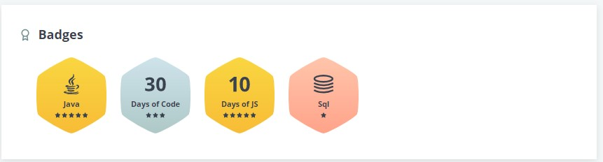
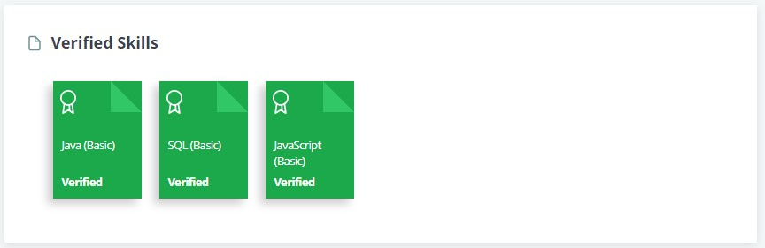

# Hi there, I'm Vivek  👋 
Full Stack Developer (MERN) | DSA in Java ❤️ | Master of Computer Application

### Connect with me:

&nbsp;

### Languages and Tools:

&nbsp; &nbsp; &nbsp;

### HackerRank Profile:

